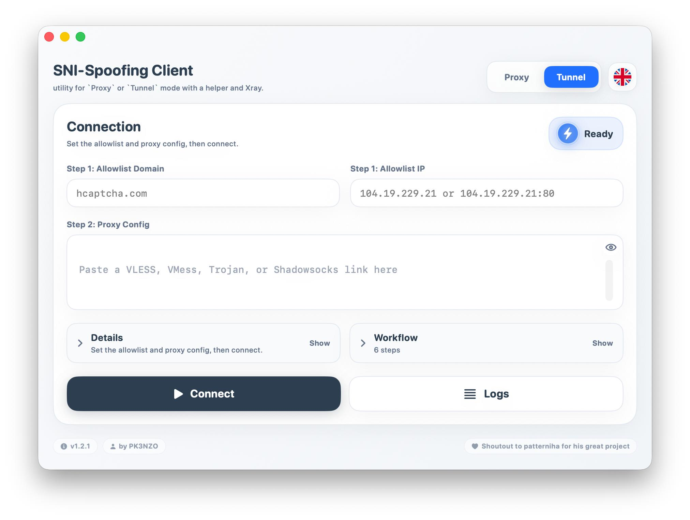

# SNI-Spoofing Client

Desktop client for running SNI-based DPI bypass workflows with a shared cross-platform runtime direction and a production macOS app.

[](https://github.com/PK3NZO/SNI-Spoofing-Client/releases)
[](https://github.com/PK3NZO/SNI-Spoofing-Client/releases)
[](LICENSE)

## Preview



A live macOS screenshot of the current desktop client UI.

## English

### Overview

SNI-Spoofing Client is a desktop project for advanced censorship-circumvention workflows that rely on SNI spoofing, local proxying, and packet-tunnel based routing.

Current public release target:

- macOS app
- Windows shared-runtime preview
- Apple Silicon (`arm64`) build
- Intel (`x86_64`) build
- `VLESS`, `VMess`, `Trojan`, and `Shadowsocks` config parsing
- `Proxy` mode and `Tunnel` mode

Current platform status:

- macOS:
  - production UI and workflow
  - `Proxy` mode
  - `Tunnel` mode
  - embedded Xray
- Windows:
  - shared runtime and desktop shell
  - `Proxy` mode foundation
  - Xray integration path
  - packaging scripts
  - `Tunnel` mode not implemented yet

### Downloads

Download the latest signed release assets from:

- [GitHub Releases](https://github.com/PK3NZO/SNI-Spoofing-Client/releases)

Expected macOS assets for `v1.2.1`:

- `SniSpoofingClient-macos-arm64-v1.2.1.dmg`
- `SniSpoofingClient-macos-x86_64-v1.2.1.dmg`
- `checksums-v1.2.1.txt`

Windows preview assets are not published as signed release artifacts yet.

### Features

- Native SwiftUI macOS app
- Shared Python runtime contracts for future Windows / Linux parity
- Clean bilingual UI: English + Persian
- Two connection modes:
  - `Proxy`
  - `Tunnel`
- Embedded Xray runtime per architecture
- Live connection workflow visibility
- Download / upload / total usage cards
- Validation hints for required inputs
- Config parsing for multiple protocols
- Windows packaging helpers with optional bundled `xray.exe`
- Windows installer pipeline with Inno Setup

### macOS Requirements

- macOS 13.3 or newer
- Administrator access for privileged networking actions
- Apple Silicon Mac for `arm64` release
- Intel Mac for `x86_64` release

### Windows Preview Requirements

- Windows with Python available for local development, or a packaged build created with the provided scripts
- Administrator access if system proxy automation is enabled
- `xray.exe` available through one of:
  - `XRAY_EXECUTABLE`
  - `resources/windows/xray.exe`
  - `PATH`

### Installation

For end users:

1. Download the correct DMG for your Mac architecture.
2. Open the DMG.
3. Drag the app into `Applications`.
4. Launch the app.
5. Grant any required macOS permissions when prompted.

For Windows preview builds:

1. Prepare `xray.exe` in `resources/windows/xray.exe` or set `XRAY_EXECUTABLE`.
2. Run the Windows desktop shell with:

```powershell
.\scripts\windows\run.ps1
```

### Build From Source

```bash
cd macos-arm
./generate_xcode_project.sh
./build_debug.sh arm64
./build_debug.sh x86_64
```

Windows desktop preview:

```powershell
.\scripts\windows\build.ps1
.\scripts\windows\package.ps1
.\scripts\windows\installer.ps1
.\scripts\windows\release.ps1
```

For a final end-user installer:

1. Run `.\scripts\windows\release.ps1`
2. The scripts auto-download `xray.exe` if needed
3. The scripts try to auto-install `Inno Setup 6` with `winget` if needed
4. Deliver `release/windows/SNI-Spoofing-Setup-v1.2.1.exe` to users

You can also build the Windows installer from macOS indirectly through GitHub Actions:

1. Push your branch to GitHub
2. Run the `Windows Installer` workflow
3. Download the `SNI-Spoofing-Setup` artifact

Release build helpers:

```bash
cd macos-arm
./build_release.sh arm64
./build_release.sh x86_64
./package_release.sh arm64
./package_release.sh x86_64
./generate_checksums.sh
```

Detailed macOS signing, DMG, and notarization guidance:

- [macOS Release Guide](docs/macos-release-guide.md)
- [Windows Workflow](scripts/windows/README.md)
- [Windows Parity Roadmap](docs/windows-parity-roadmap.md)

### Reporting Issues

If you hit a bug:

- open a GitHub issue with logs, screenshots, and reproduction steps
- include whether you used `Proxy` or `Tunnel`
- include platform and architecture
- include whether `xray.exe` was bundled, in `PATH`, or provided by `XRAY_EXECUTABLE`

### Credits

- Original project direction and release ownership: `PK3NZO`
- Special shoutout: [patterniha/SNI-Spoofing](https://github.com/patterniha/SNI-Spoofing)

---

## فارسی

### معرفی

SNI-Spoofing Client یک پروژه دسکتاپ برای سناریوهای دور زدن DPI با تکیه بر SNI spoofing، لوکال پروکسی، و packet tunnel است.

هدف ریلیز عمومی فعلی:

- اپلیکیشن macOS
- پیش‌نمایش Windows با shared runtime
- نسخه جدا برای `arm64`
- نسخه جدا برای `x86_64`
- پشتیبانی از لینک‌های `VLESS`، `VMess`، `Trojan` و `Shadowsocks`
- دو حالت اتصال:
  - `Proxy`
  - `Tunnel`

وضعیت فعلی پلتفرم‌ها:

- macOS:
  - رابط کاربری و workflow اصلی
  - حالت `Proxy`
  - حالت `Tunnel`
  - Xray داخلی
- Windows:
  - شل دسکتاپ و shared runtime
  - پایه‌ی حالت `Proxy`
  - مسیر یکپارچه‌سازی Xray
  - اسکریپت‌های پکیجینگ
  - حالت `Tunnel` هنوز پیاده‌سازی نشده است

### دانلود

جدیدترین نسخه‌ها از اینجا قابل دریافت هستند:

- [GitHub Releases](https://github.com/PK3NZO/SNI-Spoofing-Client/releases)

نام فایل‌های مورد انتظار برای `v1.2.1`:

- `SniSpoofingClient-macos-arm64-v1.2.1.dmg`
- `SniSpoofingClient-macos-x86_64-v1.2.1.dmg`
- `checksums-v1.2.1.txt`

فعلاً asset امضاشده برای Windows منتشر نمی‌شود.

### قابلیت‌ها

- اپلیکیشن native با SwiftUI
- قراردادهای shared runtime برای نزدیک نگه داشتن Windows / Linux / macOS
- رابط کاربری دو زبانه: فارسی و انگلیسی
- دو حالت اتصال:
  - `Proxy`
  - `Tunnel`
- Xray داخلی متناسب با معماری سیستم
- نمایش مرحله‌ای workflow اتصال
- نمایش زنده مصرف دانلود، آپلود و مجموع مصرف
- هایلایت ورودی‌های ناقص در زمان validation
- پشتیبانی از چند پروتکل مختلف
- اسکریپت‌های پکیجینگ Windows با امکان bundle کردن `xray.exe`
- مسیر ساخت installer برای Windows با Inno Setup

### نیازمندی‌ها

- macOS 13.3 به بالا
- دسترسی Administrator برای بعضی عملیات شبکه
- مک Apple Silicon برای نسخه `arm64`
- مک Intel برای نسخه `x86_64`

### نیازمندی‌های پیش‌نمایش Windows

- Windows با Python برای توسعه محلی، یا build بسته‌بندی‌شده
- دسترسی Administrator اگر تنظیم خودکار پروکسی سیستم فعال باشد
- وجود `xray.exe` از یکی از مسیرهای زیر:
  - `XRAY_EXECUTABLE`
  - `resources/windows/xray.exe`
  - `PATH`

### نصب

برای کاربران نهایی:

1. فایل DMG مناسب معماری سیستم خود را دانلود کنید.
2. DMG را باز کنید.
3. اپ را به پوشه `Applications` بکشید.
4. برنامه را اجرا کنید.
5. اگر macOS مجوز خواست، آن‌ها را تأیید کنید.

برای اجرای پیش‌نمایش Windows:

1. فایل `xray.exe` را در `resources/windows/xray.exe` بگذارید یا `XRAY_EXECUTABLE` را ست کنید.
2. سپس اجرا کنید:

```powershell
.\scripts\windows\run.ps1
```

### بیلد از سورس

```bash
cd macos-arm
./generate_xcode_project.sh
./build_debug.sh arm64
./build_debug.sh x86_64
```

برای ریلیز:

```bash
cd macos-arm
./build_release.sh arm64
./build_release.sh x86_64
./package_release.sh arm64
./package_release.sh x86_64
./generate_checksums.sh
```

برای build و package ویندوز:

```powershell
.\scripts\windows\build.ps1
.\scripts\windows\package.ps1
.\scripts\windows\installer.ps1
.\scripts\windows\release.ps1
```

برای خروجی مناسب کاربر نهایی در Windows:

1. فقط `.\scripts\windows\release.ps1` را اجرا کنید
2. اگر `xray.exe` نباشد، اسکریپت خودش دانلودش می‌کند
3. اگر `Inno Setup 6` نباشد، اسکریپت سعی می‌کند با `winget` خودش نصبش کند
4. فایل نهایی `release/windows/SNI-Spoofing-Setup-v1.2.1.exe` را به کاربر بدهید

اگر روی macOS هستید، می‌توانید همین خروجی ویندوز را از طریق GitHub Actions بگیرید:

1. branch را push کنید
2. workflow با نام `Windows Installer` را اجرا کنید
3. artifact با نام `SNI-Spoofing-Setup` را دانلود کنید

راهنمای کامل ساین، ساخت DMG و notarization:

- [راهنمای انتشار macOS](docs/macos-release-guide.md)
- [راهنمای Windows](scripts/windows/README.md)
- [نقشه راه parity ویندوز](docs/windows-parity-roadmap.md)

### گزارش باگ

اگر به مشکل خوردید:

- داخل GitHub issue باز کنید
- لاگ، اسکرین‌شات و مراحل بازتولید را بفرستید
- مشخص کنید از `Proxy` استفاده کرده‌اید یا `Tunnel`
- مشخص کنید پلتفرم و معماری شما چیست
- مشخص کنید `xray.exe` به‌صورت bundle بوده، در `PATH` بوده، یا با `XRAY_EXECUTABLE` داده شده است

### قدردانی

- انتشار و نگهداری پروژه: `PK3NZO`
- تشکر ویژه از: [patterniha/SNI-Spoofing](https://github.com/patterniha/SNI-Spoofing)
